### Setup A New Ubuntu System

#### Environment

* CPU: AMD® Ryzen 5 3600x
* GPU: GeForce GTX 1660 SUPER
* System: Ubuntu 18.04

#### Install Necessary Staff

```bash
# Update list
sudo apt-get update

# install network tools
sudo apt-get install net-tools

# install curl
sudo apt-get install curl

# install xclip
sudo apt-get install xclip

# install gedit plugins
sudo apt-get install gedit-plugins
```

#### Setup Pinyin Input

* Install ibus Pinyin

```bash
sudo apt-get install ibus-pinyin
```

* Start ibus setup

```bash
ibus-setup
```

* Add intelligent Pinyin in "Input Method"

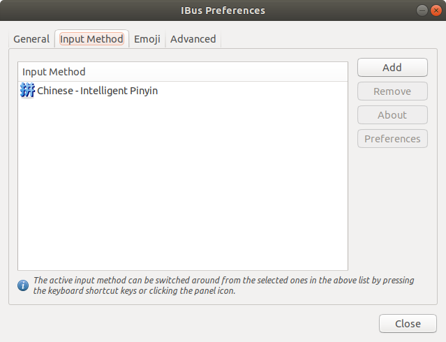

* Add intelligent Pinyin in the language setting: Chinese -> Chinese (Intelligent Pinyin)

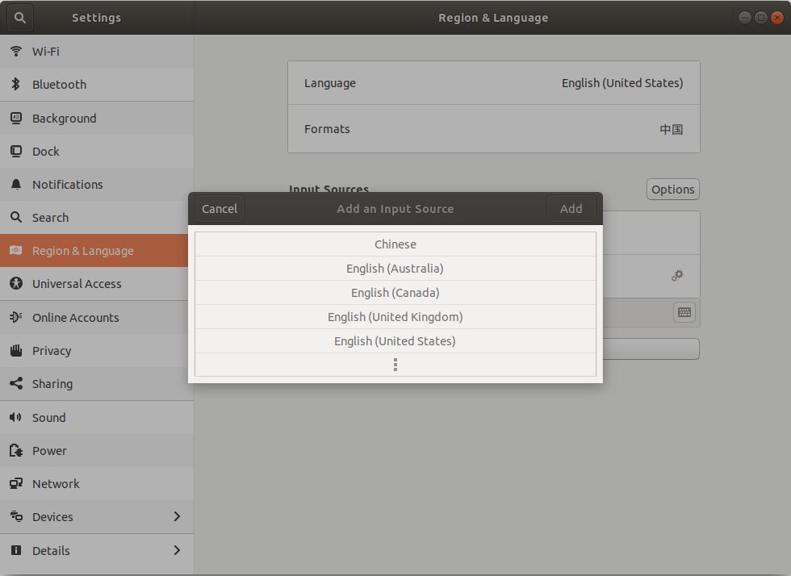

#### Setup VPN

* Follow the instruction from [shadowsocks.nz](https://portal.shadowsocks.nz/knowledgebase/151/) and install **Clashy**

* Add alias to ~/.bashrc

```bash
# Alias for proxy setting
alias setVPN="export ALL_PROXY=socks5://127.0.0.1:1080"
alias setSocksVPN="export ALL_PROXY=socks5://127.0.0.1:1080"
alias setHttpsVPN="export ALL_PROXY=https://127.0.0.1:8080"
alias unsetVPN="unset ALL_PROXY"
```

* Create desktop entry

  * Create desktop file

  ```bash
  # Create desktop file
  sudo touch /usr/share/applications/clashy.desktop
  sudo gedit /usr/share/applications/clashy.desktop
  ```

  * Edit the desktop file and save (replace *\$USRNAME* to user account name in Ubuntu)

  ```bash
  [Desktop Entry]
  Name=clashy
  Exec=/home/$USRNAME/Documents/Clashy/Clashy.AppImage
  Icon=/home/$USRNAME/Documents/Clashy/icon.png
  Type=Application
  StartupNotify=true
  Name[en_US]=Clashy
  ```

* Search **Clashy** form the menu, right click and select "Add to Favorites"

#### Install Nvidia driver

* Open **Software & Updates** and choose `Additional Drivers`

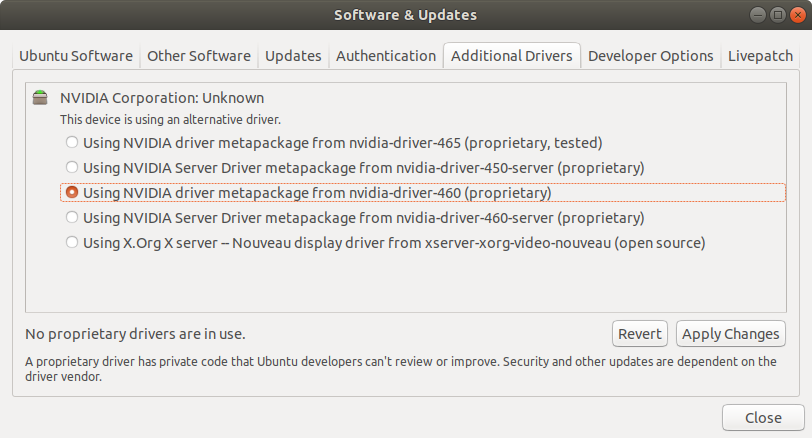

* Select latest NVIDIA driver and `Apply Changes`

#### Install Terminator

```bash
sudo apt-get install terminator
```

#### Install Chrome

```bash
# download chrome
wget https://dl.google.com/linux/direct/google-chrome-stable_current_amd64.deb

# install chrome
sudo apt-get install ./google-chrome-stable_current_amd64.deb

# clean the deb file
rm google-chrome-stable_current_amd64.deb
```

#### Install VScode

* Download install deb file in [VScode website](https://code.visualstudio.com/)
* Double click the deb file and install

#### Setup right-click menu

* Add "New Document"

```bash
touch ~/Templates/Untitled\ Document
```

* Install Nautilus extension

```bash
# add repository
sudo add-apt-repository ppa:daniel-marynicz/filemanager-actions

# install Nautilus exetension
sudo apt-get install filemanager-actions-nautilus-extension
```

* Use `fma-config-tool` to start the config tool
* Cancel root menu

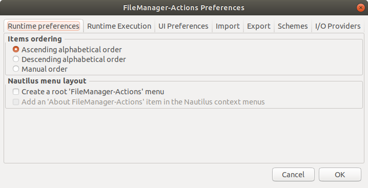

* Set "Open in Terminator" in right-click menu

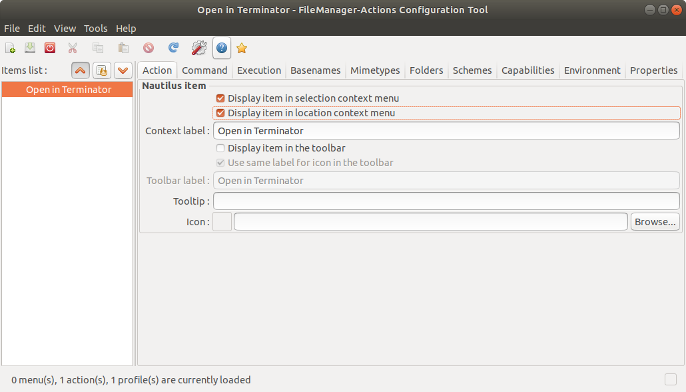

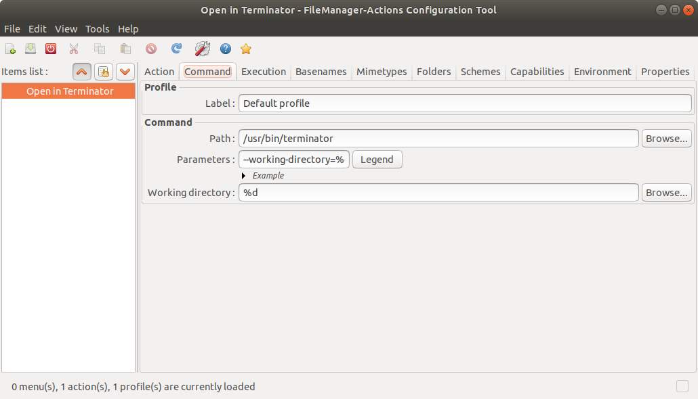

* Set "Open in VScode" in right-click menu

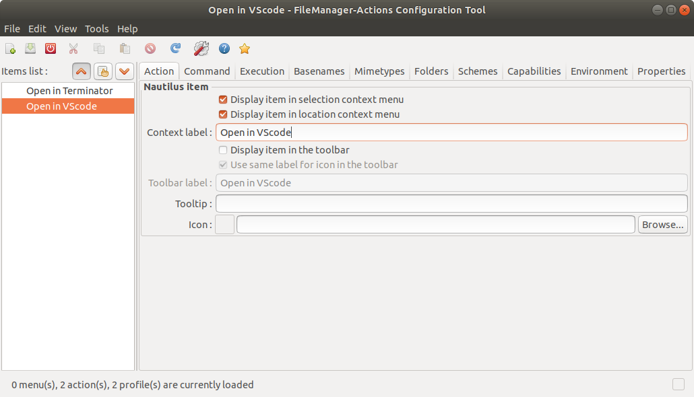

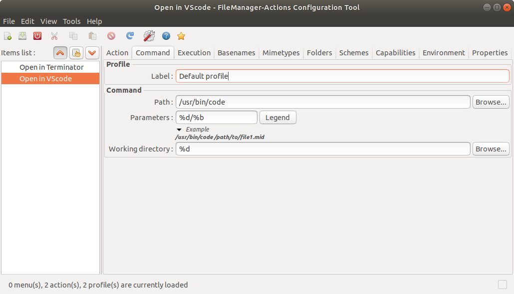

#### Install Typora

```bash
# get key from web server
wget -qO - https://typora.io/linux/public-key.asc | sudo apt-key add -

# add Typora's repository
sudo add-apt-repository 'deb https://typora.io/linux ./'
sudo apt-get update

# install typora
sudo apt-get install typora
```

#### Setup git

* Install git

```bash
sudo apt-get install git
```

* Add SSH key

  * Generate ED25519 SSH key and press Enter three times

  ```bash
  ssh-keygen -t ed25519
  ```

  * Add key to shh-agent

  ```bash
  ssh-add ~/.ssh/id_ed25519
  ```

  * Copy SHH key and add to [Github](https://docs.github.com/en/github/authenticating-to-github/connecting-to-github-with-ssh/adding-a-new-ssh-key-to-your-github-account) / [Gitlab](https://docs.gitlab.com/ee/ssh/README.html#add-an-ssh-key-to-your-gitlab-account)

  ```bash
  xclip -selection clipboard < ~/.ssh/id_ed25519.pub
  ```

* Add alias setting to ~/.bashrc

```
# Alias for git
alias github="git config --local user.name 'XXX'; git config --local user.email 'XXX@XXX.com'"
alias gitlab="git config --local user.name 'XXX'; git config --local user.email 'XXX@XXX.com'"
```

* Once we have a repository, we can use `github` or `gitlab` to set different name and email for each

#### Install ROS Melodic

* Set VPN for current terminal (See [Setup VPN](#Setup-VPN))

```bash
setVPN
```

* Install ROS

```bash
# setup sources.list
sudo sh -c 'echo "deb http://packages.ros.org/ros/ubuntu $(lsb_release -sc) main" > /etc/apt/sources.list.d/ros-latest.list'

# setup keys
curl -s https://raw.githubusercontent.com/ros/rosdistro/master/ros.asc | sudo apt-key add -

# installation
sudo apt update
sudo apt install ros-melodic-desktop-full

# setup environment
echo "source /opt/ros/melodic/setup.bash" >> ~/.bashrc
source ~/.bashrc

# install ros tools
sudo apt-get install python-rosdep python-rosinstall python-rosinstall-generator python-wstool build-essential

# initialize rosdep
sudo rosdep init
rosdep update
```

* If run `rosdep update` fail due to "timed out", refer to this [blog](https://blog.csdn.net/leida_wt/article/details/115120940?utm_medium=distribute.pc_relevant.none-task-blog-baidujs_baidulandingword-0&spm=1001.2101.3001.4242)

* install necessary ros package

```bash
# install navigation-stack
sudo apt-get install ros-melodic-navigation
```

#### Install MATLAB

* Download the MATLAB installer in [download page](https://www.mathworks.com/downloads/web_downloads?s_tid=mwa_osa_a)

* unzip and install MATLAB

```bash
# unzip MATLAB installer
unzip matlab_R202xx_glnxa64.zip

# install MATLAB
sudo sh install
```

* Follow the instructions in the installation 

  * Make sure the login name is the same as your user account name in Ubuntu
  * Select products to be installed:
    * MATLAB
    * Simulink
    * Computer Vision Toolbox
    * Control System Toolbox
    * Deep Learning Toolbox
    * Image Acquisition Toolbox
    * Image Processing Toolbox
    * MATLAB Coder
    * Model Predictive Control Toolbox
    * Optimization Toolbox
    * Reinforcement Learning Toolbox
    * Robotics System Toolbox
    * Robust Control Toolbox
    * ROS Toolbox
    * Signal Processing Toolbox
    * Statistics and Machine Learning Toolbox
    * Symbolic Math Toolbox
    * System Identification Toolbox

  * Create symbolic links in `/usr/local/bin`

* Create desktop entry

  * Create desktop file

  ```bash
  # Get MATLAB icon
  sudo wget http://upload.wikimedia.org/wikipedia/commons/2/21/Matlab_Logo.png -O /usr/share/icons/matlab.png
  
  # Create desktop file
  sudo touch /usr/share/applications/matlab.desktop
  sudo gedit /usr/share/applications/matlab.desktop
  ```
  * Edit the desktop file and save

  ```bash
  #!/usr/bin/env xdg-open
  [Desktop Entry]
  Type=Application
  Icon=/usr/share/icons/matlab.png
  Name=MATLAB
  Comment=Start MATLAB - The Language of Technical Computing
  Exec=matlab -desktop -useStartupFolderPref 
  Categories=Development;
  ```

* Search **MATLAB** form the menu, right click and select "Add to Favorites"

* Set initial working folder in MATLAB: `Home`  -> `Preferences` -> `MATLAB` -> `General` -> `Initial working folder`

#### Install CUDA

* Check supported CUDA version

```bash
 nvidia-smi
```

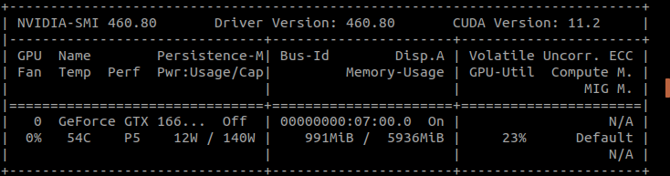

* Download and install CUDA on [official website](https://developer.nvidia.com/cuda-toolkit-archive)

```bash
wget https://developer.download.nvidia.com/compute/cuda/11.2.0/local_installers/cuda_11.2.0_460.27.04_linux.run
sudo sh cuda_11.2.0_460.27.04_linux.run
```

* Select `Continue` -> `accept` -> uncheck `Driver` -> `install` 
* Add environment variables to ~/.bashrc

```bash
export PATH="/usr/local/cuda/bin:$PATH"
export LD_LIBRARY_PATH="/usr/local/cuda/lib64:$LD_LIBRARY_PATH"
```

* Verify CUDA

```bash
nvcc -V
```

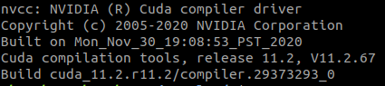

#### Install cuDNN

* Check supported cuDNN version on [official website](https://developer.nvidia.com/rdp/cudnn-archive)
* Enable the repository

```bash
wget https://developer.download.nvidia.com/compute/cuda/repos/ubuntu1804/x86_64/cuda-ubuntu1804.pin

sudo mv cuda-ubuntu1804.pin /etc/apt/preferences.d/cuda-repository-pin-600
sudo apt-key adv --fetch-keys https://developer.download.nvidia.com/compute/cuda/repos/ubuntu1804/x86_64/7fa2af80.pub
sudo add-apt-repository "deb https://developer.download.nvidia.com/compute/cuda/repos/ubuntu1804/x86_64/ /"
sudo apt-get update
```

* Install the cuDNN library

```bash
sudo apt-get install libcudnn8=8.1.1.*-1+cuda11.2
sudo apt-get install libcudnn8-dev=8.1.1.*-1+cuda11.2
```

#### Install Tensorflow

* Check supported Tensorflow version on [official website](https://www.tensorflow.org/install/source#gpu)
* Set VPN for current terminal (See [Setup VPN](#Setup-VPN))

```bash
setHttpsVPN
```

* Install Tensorflow

```bash
pip3 install tensorflow-gpu==1.14.0
```

#### Install MuJoCo

* Get license from [official website](https://www.roboti.us/license.html)
* Download MuJoCo 2.0

```bash
wget -O mujoco200.zip https://www.roboti.us/download/mujoco200_linux.zip
```

* Install MuJoCo

```bash
# Create MuJoCo folder
mkdir ~/.mujoco

# Unzip MuJoCo file
unzip mujoco200.zip -d ~/.mujoco/mujoco200

# Reorgnize the file structure
cp -r ~/.mujoco/mujoco200/mujoco200_linux/* ~/.mujoco/mujoco200
rm -r ~/.mujoco/mujoco200/mujoco200_linux

# Copy the activate key
cp mjkey.txt ~/.mujoco
cp mjkey.txt ~/.mujoco/mujoco200/bin
```

* Add environment variables to ~/.bashrc

```bash
export LD_LIBRARY_PATH=~/.mujoco/mujoco200/bin${LD_LIBRARY_PATH:+:${LD_LIBRARY_PATH}} 
export MUJOCO_KEY_PATH=~/.mujoco${MUJOCO_KEY_PATH}
```

* Add absolute path to activate key

  * Go to the simulation folder

  ```bash
  cd ~/.mujoco/mujoco200/sample
  ```

  * Open `simulate.cpp`

  ```bash
  gedit simulate.cpp
  ```

  * Search for `mj_activate()` function and pass full path of the `mjkey.txt`

  ```c++
  // activate MuJoCo license
  // mj_activate("mjkey.txt");
  mj_activate("/home/USER_NAME/.mujoco/mjkey.txt");
  ```

  * Compile the file in the same directory

  ```bash
  make
  ```

* Test MuJoCo

```bash
~/.mujoco/mujoco200/bin/simulate ~/.mujoco/mujoco200/model/humanoid.xml
```

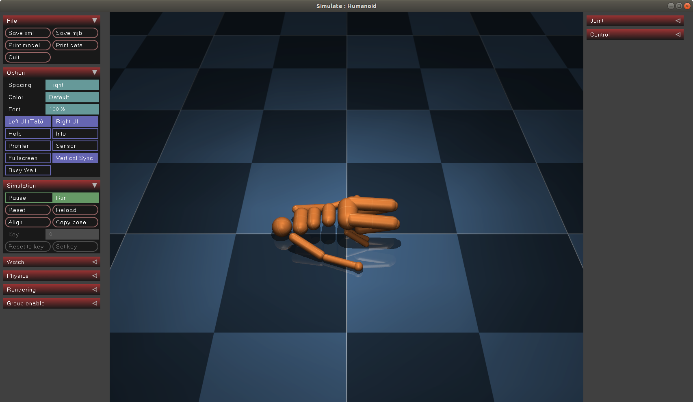

#### Install mujoco-py

* Install **pip3**

```bash
sudo apt-get install python3-pip
```

* Install requirements

```bash
# Install dependent libraries
sudo apt-get install libosmesa6-dev libgl1-mesa-glx libglfw3 libglew-dev patchelf

# Create symbolic link
sudo ln -s /usr/lib/x86_64-linux-gnu/libGL.so.1 /usr/lib/x86_64-linux-gnu/libGL.so

# Add environment variable to ~/.bashrc
echo "export LD_PRELOAD=$LD_PRELOAD:/usr/lib/x86_64-linux-gnu/libGLEW.so" >> ~/.bashrc
source ~/.bashrc

# Install dependent python package
pip3 install fasteners
```

* Install mujoco-py

```bash
pip3 install -U 'mujoco-py<2.1,>=2.0'
```

* Test mujoco-py

  * Start Python3

  ```bash
  python3
  ```

  * Run the following code

  ```python
  import mujoco_py
  import os
  
  mj_path, _ = mujoco_py.utils.discover_mujoco()
  xml_path = os.path.join(mj_path, 'model', 'humanoid.xml')
  model = mujoco_py.load_model_from_path(xml_path)
  sim = mujoco_py.MjSim(model)
  
  print(sim.data.qpos)
  # [0. 0. 0. 0. 0. 0. 0. 0. 0. 0. 0. 0. 0. 0. 0. 0. 0. 0. 0. 0. 0.]
  
  sim.step()
  print(sim.data.qpos)
  # [-2.09531783e-19  2.72130735e-05  6.14480786e-22 -3.45474715e-06
  #   7.42993721e-06 -1.40711141e-04 -3.04253586e-04 -2.07559344e-04
  #   8.50646247e-05 -3.45474715e-06  7.42993721e-06 -1.40711141e-04
  #  -3.04253586e-04 -2.07559344e-04 -8.50646247e-05  1.11317030e-04
  #  -7.03465386e-05 -2.22862221e-05 -1.11317030e-04  7.03465386e-05
  #  -2.22862221e-05]
  
  exit()
  ```
  
  * Run the example code in [mujoco-py](https://github.com/openai/mujoco-py)
  
  ```bash
  python3 examples/body_interaction.py
  ```
  
  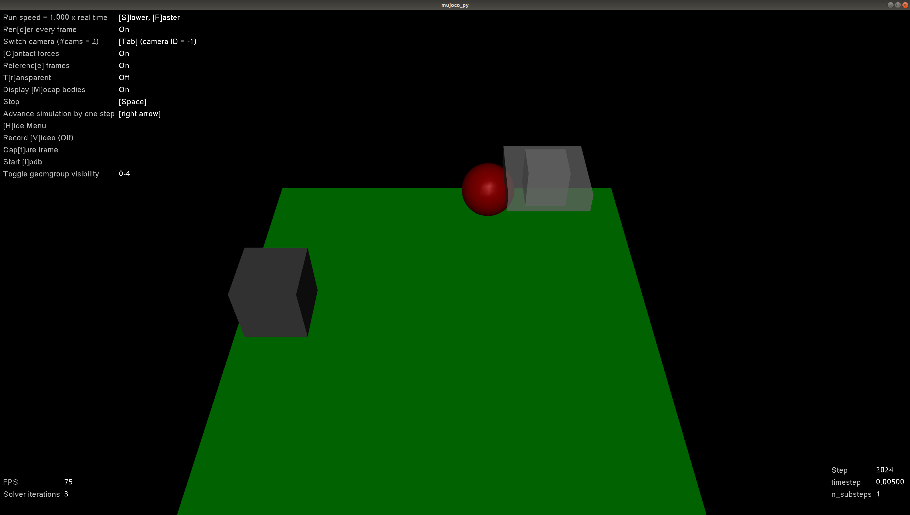

#### Install Gym

* Install Gym

```bash
pip3 install gym
```

* Test Gym
  * Start python3

  ```bash
  python3
  ```

  * Run the following code

  ```python
  import gym
  env = gym.make("CartPole-v1")
  observation = env.reset()
  for _ in range(1000):
    env.render()
    action = env.action_space.sample() # your agent here (this takes random actions)
    observation, reward, done, info = env.step(action)
  
    if done:
      observation = env.reset()
  env.close()
  ```

#### Install OpenAI Baselines

* Install requirements

```bash
# Install dependent libraries
sudo apt-get install cmake libopenmpi-dev python3-dev zlib1g-dev

# Install dependent python package
pip3 install scikit-build
```

* Clone the repository and go to the path

```bash
git clone https://github.com/openai/baselines.git
cd baselines
```

* Install OpenAI Baselines

```bash
pip3 install -e .
```

